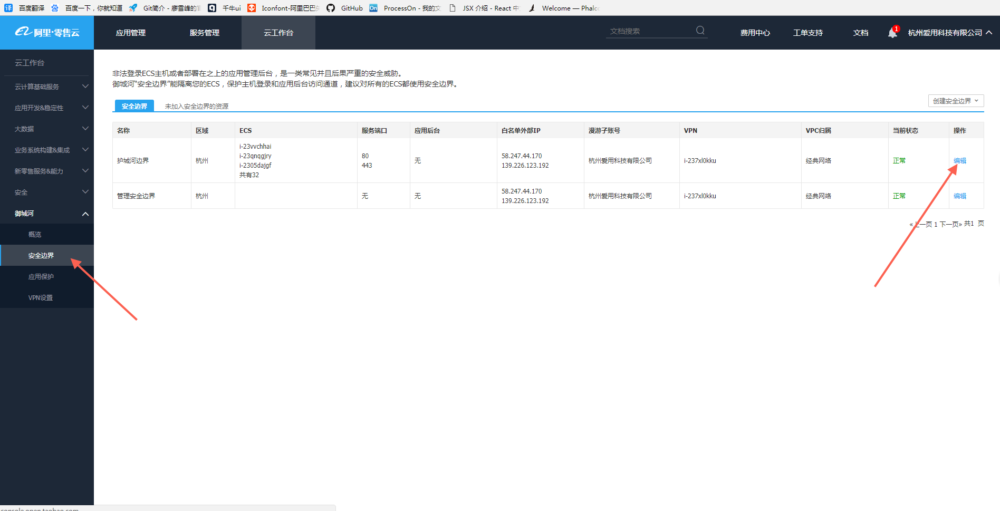
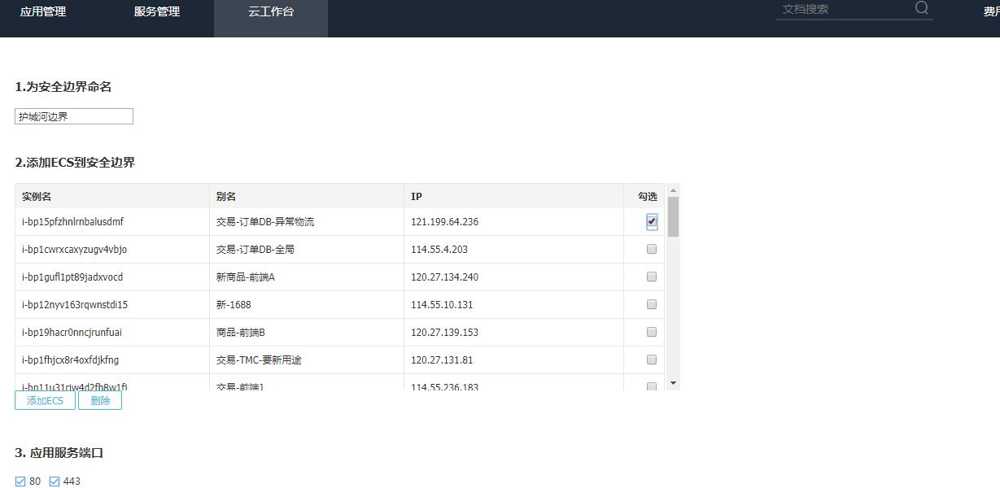
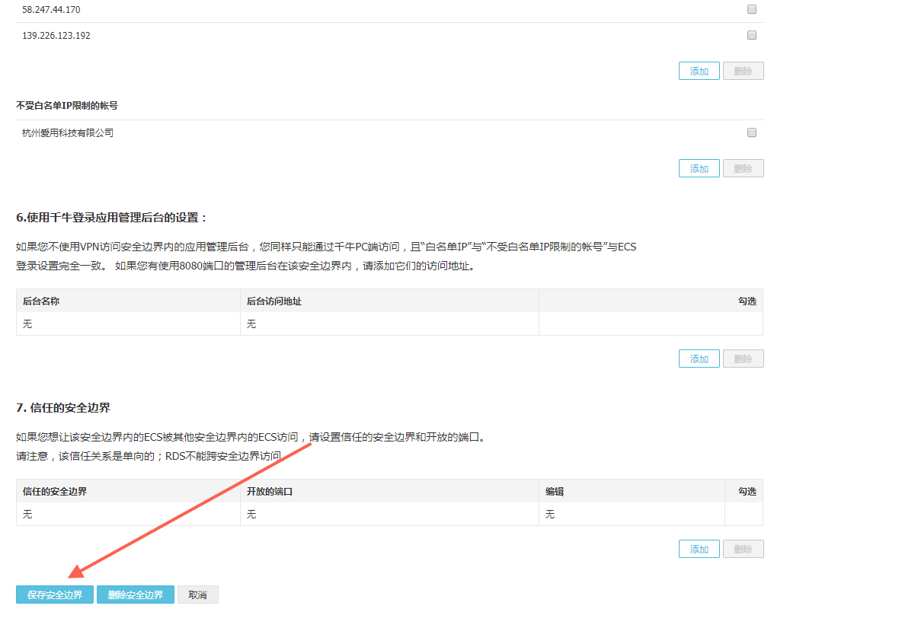
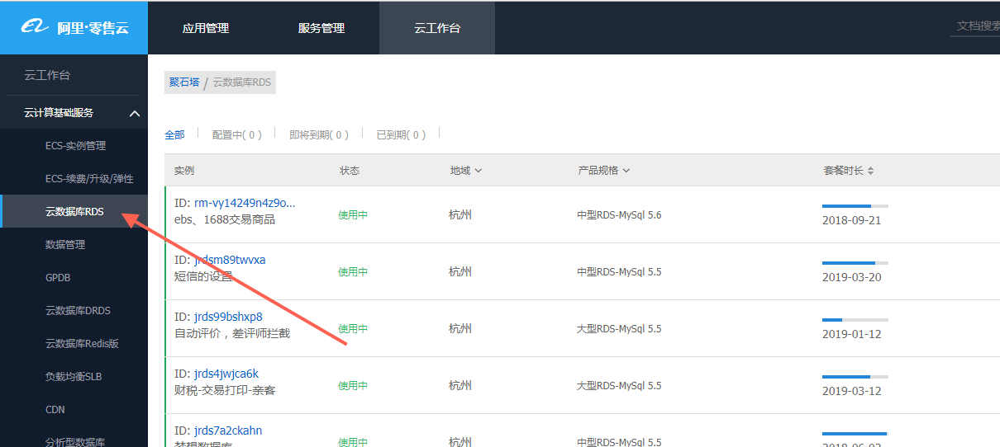

<h1>装机文档</h1>

在开放平台设置安全边界

勾选机器

保存

设置数据库白名单

添加主机名

1.新增机器（注意密码大小写！）
groupadd -f aiyong
useradd -g aiyong aiyong
passwd aiyong

2.给aiyong账号权限
visudo
root    ALL=(ALL)       ALL
aiyong  ALL=(ALL)       ALL

3.下载配置更新包
yum upgrade
yum install zsh

4.禁用root账号登录
vim /etc/ssh/sshd_config
PermitRootLogin no

5.重启sshd服务
service sshd restart

二 以下操作换aiyong账号进行

1.打开文件？？
sudo vim /etc/motd

2.准备编译环境
sudo yum -y install git autoconf gcc pcre-devel openssl openssl-devel readline-devel bind-utils traceroute mlocate lrzsz openssl openssl-libs openssl-devel unzip screen optipng libjpeg-turbo-utils gifsicle

3.git下载sh
sh -c "$(curl -fsSL https://raw.github.com/robbyrussell/oh-my-zsh/master/tools/install.sh)"

4.新建文件夹(以下都在改目录下操作)
sudo mkdir source
cd source

5.下载压缩包，解压
wget http://luajit.org/download/LuaJIT-2.0.4.tar.gz
tar zxvf LuaJIT-2.0.4.tar.gz
cd LuaJIT-2.0.4
6.以下make都要在下载目录下
make
sudo make install

7.lua最后做link，链接到当前面目录
sudo ln -s /usr/local/lib/libluajit-5.1.so.2 /lib64/libluajit-5.1.so.2

8.cd ..

9.下载
git clone https://github.com/simpl/ngx_devel_kit
git clone https://github.com/openresty/lua-nginx-module
git clone https://github.com/openresty/set-misc-nginx-module
git clone https://github.com/openresty/redis2-nginx-module
git clone https://github.com/openresty/echo-nginx-module
git clone https://github.com/openresty/ngx_postgres
下载libqb

10.新建文件夹，并增加aiyong权限
sudo mkdir /usr/local/webserver
sudo chown aiyong.aiyong /usr/local/webserver
sudo mkdir /usr/local/webserver/tengine

11.打开/etc/profile，新增配置
sudo vim /etc/profile

export LUAJIT_LIB=/usr/local/lib
export LUAJIT_INC=/usr/local/include/luajit-2.0
export LUA_INCLUDE_DIR=/usr/local/include/luajit-2.0

12.下载tengine压缩包并解压
sudo wget http://tengine.taobao.org/download/tengine-2.2.0.tar.gz
sudo tar zxvf tengine-2.2.0.tar.gz

--with-syslog

13.cd tengine-2.2.0
14.sodu ./configure --prefix=/usr/local/webserver/tengine --pid-path=/usr/local/webserver/tengine/nginx.pid --with-http_stub_status_module  --with-ld-opt=-Wl,-rpath,/usr/lib64 --with-http_ssl_module  --with-http_v2_module --add-module=/home/aiyong/source/ngx_devel_kit --add-module=/home/aiyong/source/redis2-nginx-module --add-module=/home/aiyong/source/lua-nginx-module --add-module=/home/aiyong/source/echo-nginx-module --add-module=/home/aiyong/source/set-misc-nginx-module  --with-ipv6 --add-module=/home/aiyong/source/ngx_postgres

/etc/tengine-2.2.0

15.make -j2
make install

16.下载mysql（在tengin目录下下载）?
sudo rpm -ivh http://repo.mysql.com/mysql57-community-release-el6-8.noarch.rpm
sudo yum install -y mariadb-devel mariadb-libs mariadb --skip-broken

sudo yum install -y libxml2 libxml2-devel libcurl libcurl-devel libjpeg-turbo libjpeg-turbo-devel libpng libpng-devel freetype freetype-devel openldap openldap-devel libmcrypt libmcrypt-devel re2c file

sudo groupadd -f nginx
sudo useradd -s /sbin/nologin -g nginx nginx

17.安装php （在source目录下）
wget  http://cn.php.net/distributions/php-7.1.8.tar.gz
tar zxvf php-7.1.8.tar.gz
sudo cp -frp /usr/lib64/libldap* /usr/lib/

./configure --prefix=/usr/local/webserver/php --with-config-file-path=/usr/local/webserver/php/etc --with-pgsql=/usr/pgsql-10 --with-pdo-pgsql=/usr/pgsql-10/ --with-mysqli=shared,mysqlnd --with-pdo-mysql --with-iconv-dir=/usr/local --with-freetype-dir --with-jpeg-dir --with-png-dir --with-zlib --with-libxml-dir=/usr --enable-xml --disable-rpath  --enable-bcmath --enable-shmop --enable-sysvsem --enable-inline-optimization --with-curl --enable-mbregex  --enable-fpm  --enable-mbstring --with-mcrypt --with-gd --enable-gd-native-ttf --with-openssl --with-mhash --enable-pcntl --enable-sockets --with-xmlrpc --enable-zip --enable-soap --enable-opcache --with-fpm-user=nginx  --with-fpm-group=nginx --with-mysqli --with-ldap=shared --with-ldap-sasl

make -j2 & make install 

18.带安装PGSQL支持
sudo yum install https://download.postgresql.org/pub/repos/yum/10/redhat/rhel-7-x86_64/pgdg-centos10-10-2.noarch.rpm //修改为2
sudo yum install postgresql10-devel

19.预编译pgsql支持
cd /ext/pgsql 
/usr/local/webserver/php/bin/phpize
./configure  --with-php-config=/usr/local/webserver/php/bin/php-config
make
make install
修改php.ini
pgsql.so

20.下载Php-Redis
git clone https://github.com/phpredis/phpredis.git
/usr/local/webserver/php/bin/phpize
 1.进入phpredis目录
./configure  --with-php-config=/usr/local/webserver/php/bin/php-config
make
make install
修改php.ini
redis.so

21.安装Phalcon

git clone --depth=1 "git://github.com/phalcon/cphalcon.git"
cd cphalcon/build
./install --phpize /usr/local/webserver/php/bin/phpize --php-config /usr/local/webserver/php/bin/php-config

22.安装Yaf

git clone https://github.com/laruence/yaf
/usr/local/webserver/php/bin/phpize
./configure --with-php-config=/usr/local/webserver/php/bin/php-config
make -j2
make install

 23.安装Yaconf
git clone https://github.com/laruence/yaconf
/usr/local/webserver/php/bin/phpize
./configure --with-php-config=/usr/local/webserver/php/bin/php-config
make -j2
make install

24.安装Yac

git clone https://github.com/laruence/yac.git
cd yac
sudo /usr/local/webserver/php/bin/phpize
./configure --with-php-config=/usr/local/webserver/php/bin/php-config
make -j2
make install

修改配置php文件
vim /usr/local/webserver/php/etc/php.ini
extension=yac.so

yac.enable = 1
yac.keys_memory_size = 4M
yac.values_memory_size = 64M
yac.compress_threshold = -1
yac.enable_cli = 0

source目录
sudo yum install lua-devel
git clone https://github.com/openresty/lua-cjson.git
cd lua-cjson
sudo make
sudo make install

git clone https://github.com/openresty/lua-resty-redis.git
sudo make install
00
git clone https://github.com/agentzh/lua-resty-mysql
sudo make install

git clone https://github.com/liseen/lua-resty-http
sudo make install

git clone https://github.com/dcshi/lua-resty-Logger
cd lua-resty-Logger/lib/resty
sudo cp logger.lua  /usr/local/lib/lua/resty/

git clone https://github.com/openresty/lua-redis-parser.git
make LUA_INCLUDE_DIR=/usr/local/include/luajit-2.0
sudo make install

sudo cp -rf /usr/local/lib/lua/resty /usr/local/share/lua/5.1/

sudo yum install -y ImageMagick xorg-x11-server-Xvfb.x86_64
sudo yum install pango-devel
sudo ln -s /usr/bin/convert /usr/local/bin/convert

wget http://www.guangmingsoft.net/htmlsnapshot/html2image.x86_64.tar.gz
tar zxvf html2image.x86_64.tar.gz
sudo mv html2image-x86_64 /usr/local/html2image
sudo yum -y install gtk2-devel

准备磁盘（高危！！！谨慎操作！！）
sudo fdisk /dev/vdb
sudo mkfs.ext4 /dev/vdb1

sudo vim /etc/fstab
/dev/vdb1              /data                   ext4    defaults        0 0

建立data目录
sudo mkdir /data
sudo chown aiyong.aiyong /data
sudo mount /dev/vdb1 /data
sudo chown aiyong.aiyong /data

重启生效
sudo reboot

系统性能调优

sudo vim  /etc/sysctl.conf

# System default settings live in /usr/lib/sysctl.d/00-system.conf.
# To override those settings, enter new settings here, or in an /etc/sysctl.d/<name>.conf file
#
# For more information, see sysctl.conf(5) and sysctl.d(5).

# 避免放大攻击
net.ipv4.icmp_echo_ignore_broadcasts = 1

# 开启恶意icmp错误消息保护
net.ipv4.icmp_ignore_bogus_error_responses = 1

#关闭路由转发
net.ipv4.ip_forward = 0
net.ipv4.conf.all.send_redirects = 0
net.ipv4.conf.default.send_redirects = 0

#开启反向路径过滤

net.ipv4.conf.all.rp_filter = 1
net.ipv4.conf.default.rp_filter = 1

#处理无源路由的包
net.ipv4.conf.all.accept_source_route = 0
net.ipv4.conf.default.accept_source_route = 0

#关闭sysrq功能
kernel.sysrq = 0

#core文件名中添加pid作为扩展名
kernel.core_uses_pid = 1

# 开启SYN洪水攻击保护
net.ipv4.tcp_syncookies = 1

#修改消息队列长度
kernel.msgmnb = 65536
kernel.msgmax = 65536

#设置最大内存共享段大小bytes
kernel.shmmax = 68719476736
kernel.shmall = 4294967296

#timewait的数量，默认180000
net.ipv4.tcp_max_tw_buckets = 50000
net.ipv4.tcp_sack = 1
net.ipv4.tcp_window_scaling = 1
net.ipv4.tcp_rmem = 4096        87380   4194304
net.ipv4.tcp_wmem = 4096        16384   4194304
net.core.wmem_default = 8388608
net.core.rmem_default = 8388608
net.core.rmem_max = 16777216
net.core.wmem_max = 16777216

#每个网络接口接收数据包的速率比内核处理这些包的速率快时，允许送到队列的数据包的最大数目
net.core.netdev_max_backlog = 262144

#限制仅仅是为了防止简单的DoS 攻击
net.ipv4.tcp_max_orphans = 3276800

#未收到客户端确认信息的连接请求的最大值
net.ipv4.tcp_max_syn_backlog = 262144
net.ipv4.tcp_timestamps = 0                                              
net.ipv4.tcp_fastopen = 3

#内核放弃建立连接之前发送SYNACK 包的数量
net.ipv4.tcp_synack_retries = 1

#内核放弃建立连接之前发送SYN 包的数量
net.ipv4.tcp_syn_retries = 1

#启用timewait 快速回收
net.ipv4.tcp_tw_recycle = 1

#开启重用。允许将TIME-WAIT sockets 重新用于新的TCP 连接
net.ipv4.tcp_tw_reuse = 1
net.ipv4.tcp_mem = 94500000 915000000 927000000
net.ipv4.tcp_fin_timeout = 1

#当keepalive 起用的时候，TCP 发送keepalive 消息的频度。缺省是2 小时

net.ipv4.tcp_keepalive_time = 1
net.ipv4.tcp_orphan_retries=3
net.ipv4.tcp_keepalive_probes=5

vm.swappiness = 0
net.ipv4.neigh.default.gc_stale_time=120
net.ipv4.conf.default.arp_announce = 2
net.ipv4.conf.all.arp_announce=2
net.ipv6.conf.all.disable_ipv6 = 1
net.ipv6.conf.default.disable_ipv6 = 1
net.ipv6.conf.lo.disable_ipv6 = 1
net.ipv4.conf.lo.arp_announce=2

#为php7开启大内存
vm.nr_hugepages=512

sudo sysctl -p

以下是配置Nginx,PHP-FPM等应用软件

cd /data
mkdir srv
cd srv
mkdir /data/syslog/
chmod a+w /data/syslog/
mkdir /data/tmp
mkdir /data/tmp/logs
chmod a+w /data/tmp/ -R

git clone https://github.com/aiyongbao/tradegule tradegule.aiyongbao.com
cd tradegule.aiyongbao.com
git submodule init
git submodule update

mkdir /data/srv/tradegule.aiyongbao.com/logs
chmod a+w /data/srv/tradegule.aiyongbao.com/logs

cd conf
cp php.ini /usr/local/webserver/php/etc/
cp php-fpm.conf /usr/local/webserver/php/etc/
cp www.conf /usr/local/webserver/php/etc/php-fpm.d

注意www.conf需要修改一下
16G内存的机器，php-fpm应该可以开到800个左右，看free -h的数量

pm = ondemand
pm.max_children = 800
pm.process_idle_timeout = 30s;
pm.max_requests = 1000

sudo cp php-fpm.service /usr/lib/systemd/system/
sudo systemctl enable php-fpm.service
sudo systemctl start php-fpm

cp nginx.conf /usr/local/webserver/tengine/conf
mkdir /usr/local/webserver/tengine/conf/vhost
cp tradegule.aiyongbao.com.conf /usr/local/webserver/tengine/conf/vhost
sudo cp nginx.service /usr/lib/systemd/system/
sudo systemctl enable nginx.service
sudo systemctl start nginx

安装字体

cd /usr/share/fonts
sudo mkdir chinese
sudo chmod u+rwx chinese
cd chinese

sudo mkfontscale
sudo mkfontdir
sudo fc-cache -fv

开机启动

mkdir /data/srv/itemgule.aiyongbao.com/tmp

/etc/rc.d/init.d/autostart.sh

mount -t tmpfs -o size=512m tmpfs /data/srv/itemgule.aiyongbao.com/tmp
chown nginx.nginx /data/srv/itemgule.aiyongbao.com/tmp
/usr/bin/Xvfb :1 -screen 0 640x480x24 -nolisten tcp -audit 4 -auth X1.cfg & export DISPLAY=:1

chmod +x /etc/rc.d/init.d/autostart.sh

ImageMagick字体支持 

convert -list font
/usr/local/Cellar/imagemagick/7.0.7-11/etc/ImageMagick-7/type-apple.xml

sudo vim /etc/ImageMagick/type-ghostscript.xml

  <type
     format="ttf"
     name="Microsoft-YaHei-Bold"
     fullname="Microsoft-YaHei-Bold"
     family="Microsoft YaHei"
     glyphs="/usr/share/fonts/chinese/msyhbd.ttf"
     />
  <type
     format="ttf"
     name="Microsoft-YaHei"
     fullname="Microsoft-YaHei-Regular"
     family="Microsoft YaHei"
     glyphs="/usr/share/fonts/chinese/msyh.ttf"
     />
  <type
     format="ttf"
     name="ArialB"
     fullname="Arial Bold"
     family="Arial"
     glyphs="/usr/share/fonts/chinese/arialbd.ttf"
     />
  <type
     format="ttf"
     name="Arial"
     fullname="Arial"
     family="Arial"
     glyphs="/usr/share/fonts/chinese/arial.ttf"
     />
  <type
     format="ttf"
     name="SimHei"
     fullname="SimHei-Regular"
     family="SimHei"
     glyphs="/usr/share/fonts/chinese/simhei.ttf"
     />
